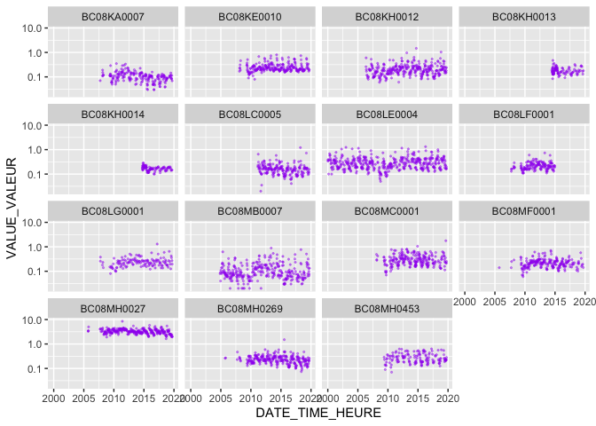

<!-- badges: start -->

<a rel="Exploration" href="https://github.com/BCDevExchange/assets/blob/master/README.md"></a>
[](https://travis-ci.org/bcgov/canwqdata)[](https://opensource.org/licenses/Apache-2.0)
[](https://github.com/bcgov/canwqdata/actions?workflow=R-CMD-check)
<!-- badges: end -->

# canwqdata

An R 📦 to download open water quality data from Environment and Climate
Change Canada’s [National Long-term Water Quality Monitoring
Data](http://donnees.ec.gc.ca/data/substances/monitor/national-long-term-water-quality-monitoring-data/).

### Features

This package is designed to get Canadian Water Quality Monitoring data
into R quickly and easily. You can get data from a single monitoring
station, multiple stations, or from an entire basin.

### Installation

``` r
remotes::install_github("bcgov/canwqdata")
```

### Usage

First load the package:

``` r
library(canwqdata)
```

The first thing you will probably want to do is get a list of the
available sites and associated metadata:

``` r
sites <- wq_sites()

sites
#> # A tibble: 339 x 16
#>    SITE_NO SITE_NAME SITE_NOM_FR SITE_TYPE SITE_DESC SITE_DESC_FR LATITUDE
#>    <chr>   <chr>     <chr>       <chr>     <chr>     <chr>           <dbl>
#>  1 72      BEAUHARN… CANAL DE B… RIVER/RI… <NA>      <NA>             45.2
#>  2 75      ST.LAWRE… FLEUVE SAI… RIVER/RI… <NA>      <NA>             45.9
#>  3 78      ST.LAWRE… FLEUVE SAI… RIVER/RI… <NA>      <NA>             45.4
#>  4 2330001 ETCHEMIN… RIVIÈRE ET… RIVER/RI… <NA>      <NA>             46.8
#>  5 2340033 CHAUDIÈR… RIVIÈRE CH… RIVER/RI… <NA>      <NA>             46.7
#>  6 2400004 BÉCANCOU… RIVIÈRE BÉ… RIVER/RI… <NA>      <NA>             46.4
#>  7 3020073 MAGOG RI… RIVIÈRE MA… RIVER/RI… <NA>      <NA>             45.3
#>  8 3020333 COATICOO… RIVIÈRE CO… RIVER/RI… <NA>      <NA>             45.3
#>  9 3040010 RICHELIE… RIVIÈRE RI… RIVER/RI… <NA>      <NA>             45.4
#> 10 3040012 RICHELIE… RIVIÈRE RI… RIVER/RI… <NA>      <NA>             45.1
#> # … with 329 more rows, and 9 more variables: LONGITUDE <dbl>, DATUM <chr>,
#> #   PROV_TERR <chr>, PEARSEDA <chr>, PEARSEDA_FR <chr>, OCEANDA <chr>,
#> #   OCEANDA_FR <chr>, DATA_URL <chr>, DATA_URL_FR <chr>
```

Then get some data from a particular station:

`AL07AA0015` is a site in Alberta called *Athabasca River above
Athabasca Falls*

``` r
athabasca_falls <- wq_site_data("AL07AA0015")

athabasca_falls
#> # A tibble: 10,538 x 11
#>    SITE_NO DATE_TIME_HEURE     FLAG_MARQUEUR VALUE_VALEUR SDL_LDE MDL_LDM
#>    <chr>   <dttm>              <chr>                <dbl>   <dbl>   <dbl>
#>  1 AL07AA… 2000-01-11 13:05:00 <NA>               93.2         NA      NA
#>  2 AL07AA… 2000-01-11 13:05:00 <                   0.02        NA      NA
#>  3 AL07AA… 2000-01-11 13:05:00 <                   0.005       NA      NA
#>  4 AL07AA… 2000-01-11 13:05:00 <NA>                0           NA      NA
#>  5 AL07AA… 2000-01-11 13:05:00 <                   0.0001      NA      NA
#>  6 AL07AA… 2000-01-11 13:05:00 <NA>                0.065       NA      NA
#>  7 AL07AA… 2000-01-11 13:05:00 <                   0.5         NA      NA
#>  8 AL07AA… 2000-01-11 13:05:00 <NA>              114.          NA      NA
#>  9 AL07AA… 2000-01-11 13:05:00 <                   0.002       NA      NA
#> 10 AL07AA… 2000-01-11 13:05:00 <                   0.001       NA      NA
#> # … with 10,528 more rows, and 5 more variables: VMV_CODE <chr>,
#> #   UNIT_UNITE <chr>, VARIABLE <chr>, VARIABLE_FR <chr>, STATUS_STATUT <chr>
```

We can also get data from more than one station:

``` r
wq_site_data(c("YT09FC0002", "SA05JM0014"))
#> # A tibble: 23,932 x 11
#>    SITE_NO DATE_TIME_HEURE     FLAG_MARQUEUR VALUE_VALEUR SDL_LDE MDL_LDM
#>    <chr>   <dttm>              <chr>                <dbl>   <dbl>   <dbl>
#>  1 SA05JM… 2000-03-07 12:45:00 <NA>                0           NA      NA
#>  2 SA05JM… 2000-03-07 12:45:00 <NA>              253           NA      NA
#>  3 SA05JM… 2000-03-07 12:45:00 <NA>                0.047       NA      NA
#>  4 SA05JM… 2000-03-07 12:45:00 <NA>                0.607       NA      NA
#>  5 SA05JM… 2000-03-07 12:45:00 <NA>                0.079       NA      NA
#>  6 SA05JM… 2000-03-07 12:45:00 <NA>                0.001       NA      NA
#>  7 SA05JM… 2000-03-07 12:45:00 <NA>                0.039       NA      NA
#>  8 SA05JM… 2000-03-07 12:45:00 <NA>                0.0569      NA      NA
#>  9 SA05JM… 2000-03-07 12:45:00 <                   0.5         NA      NA
#> 10 SA05JM… 2000-03-07 12:45:00 <                   0.05        NA      NA
#> # … with 23,922 more rows, and 5 more variables: VMV_CODE <chr>,
#> #   UNIT_UNITE <chr>, VARIABLE <chr>, VARIABLE_FR <chr>, STATUS_STATUT <chr>
```

Or an entire basin:

The basins are in the `PEARSEDA` column of the data.frame returned by
`wq_sites()`:

``` r
basins <- sort(unique(sites$PEARSEDA))
basins
#>  [1] "ARCTIC COAST-ISLANDS"      "ASSINIBOINE-RED"          
#>  [3] "CHURCHILL"                 "COLUMBIA"                 
#>  [5] "FRASER-LOWER MAINLAND"     "GREAT LAKES"              
#>  [7] "KEEWATIN-SOUTHERN BAFFIN"  "LOWER MACKENZIE"          
#>  [9] "LOWER SASKATCHEWAN-NELSON" "MARITIME COASTAL"         
#> [11] "MISSOURI"                  "NEWFOUNDLAND-LABRADOR"    
#> [13] "NORTH SASKATCHEWAN"        "NORTH SHORE-GASPÉ"        
#> [15] "OKANAGAN-SIMILKAMEEN"      "OTTAWA"                   
#> [17] "PACIFIC COASTAL"           "PEACE-ATHABASCA"          
#> [19] "SAINT JOHN-ST. CROIX"      "SOUTH SASKATCHEWAN"       
#> [21] "ST. LAWRENCE"              "WINNIPEG"                 
#> [23] "YUKON"

fraser <- wq_basin_data("FRASER-LOWER MAINLAND")
```

Do some quick summary stats of the fraser dataset:

``` r
library(dplyr)

fraser %>% 
  group_by(SITE_NO) %>% 
  summarise(first_date = min(DATE_TIME_HEURE), 
            latest_date = max(DATE_TIME_HEURE), 
            n_params = length(unique(VARIABLE)), 
            total_samples = n())
#> # A tibble: 15 x 5
#>    SITE_NO    first_date          latest_date         n_params total_samples
#>    <chr>      <dttm>              <dttm>                 <int>         <int>
#>  1 BC08KA0007 2000-01-12 07:45:00 2019-09-12 08:58:00      108         24941
#>  2 BC08KE0010 2000-01-05 00:00:00 2019-09-16 10:00:00       76         23477
#>  3 BC08KH0012 2006-05-11 13:07:00 2019-09-29 08:30:00      140         19511
#>  4 BC08KH0013 2014-06-16 12:45:00 2019-09-23 09:45:00      107         10375
#>  5 BC08KH0014 2014-09-23 14:00:00 2019-09-09 06:55:00      110          9397
#>  6 BC08LC0005 2011-02-24 09:45:00 2019-09-18 11:20:00       69         11866
#>  7 BC08LE0004 2000-01-04 10:00:00 2019-10-02 11:30:00      112         23469
#>  8 BC08LF0001 2000-01-05 12:00:00 2014-12-15 10:20:00       89         18410
#>  9 BC08LG0001 2003-06-24 10:45:00 2019-09-18 14:30:00       71         10366
#> 10 BC08MB0007 2004-11-15 12:00:00 2019-10-01 12:21:00      105         21297
#> 11 BC08MC0001 2000-04-18 16:30:00 2019-09-30 08:37:00      107         21775
#> 12 BC08MF0001 2000-01-04 14:10:00 2019-09-12 12:00:00      129         21475
#> 13 BC08MH0027 2000-01-07 12:16:00 2019-09-24 12:02:00      115         34775
#> 14 BC08MH0269 2004-03-03 14:40:00 2019-09-24 13:45:00      137         25932
#> 15 BC08MH0453 2008-09-02 16:25:00 2019-09-30 12:00:00      107         13389
```

We can also look at metadata that helps us understand what is in the
different columns.

`wq_params()` returns a list of water quality parameters (variables),
and related data - units, methods, codes, etc:

``` r
params <- wq_params()
glimpse(params)
#> Observations: 1,964
#> Variables: 12
#> $ VMV_CODE                <chr> "77", "78", "79", "80", "157", "160", "201", …
#> $ NATIONAL_VARIABLE_CODE  <chr> "635", "365", "4541", "414", "864", "1073", "…
#> $ VARIABLE_COMMON_NAME    <chr> "Nitrogen total", "Alkalinity total HCO3", "C…
#> $ VARIABLE_COMMON_NAME_FR <chr> "Azote total", "Alcalinité totale HCO3", "Chl…
#> $ VARIABLE_TYPE           <chr> "Nitrogen", "Physical", "Chlorophyll", "Chlor…
#> $ VARIABLE_TYPE_FR        <chr> "Azote", "Physique", "Chlorophylle", "Chlorop…
#> $ MEASUREMENT_UNIT        <chr> "mg/L", "mg/L", "µg/L", "µg/L", "NTU", "mg/L"…
#> $ DESCRIPTION             <chr> "milligram per liter", "milligram per liter",…
#> $ DESCRIPTION_FR          <chr> "milligramme par litre", "milligramme par lit…
#> $ NATIONAL_METHOD_CODE    <chr> "23", "30", "35", "41", "188", "189", "8", "9…
#> $ METHOD_TITLE            <chr> "Total nitrogen measurement by persulfate oxi…
#> $ METHOD_TITLE_FR         <chr> "Azote total par la méthode d'oxydation au pe…

# wq_param_desc shows the column headings (in all other tables) and what they mean
wq_data_desc() %>% 
  glimpse()
#> Observations: 39
#> Variables: 5
#> $ COL_TITLE_TITRE    <chr> "COL_DESCRIPTION", "COL_DESCRIPTION_FR", "COL_TITL…
#> $ COL_TITLE_FULL     <chr> "COLUMN HEADER DESCRIPTION", "COLUMN HEADER DESCRI…
#> $ COL_TITRE_COMPLET  <chr> "DESCRIPTION DE L'EN-TÊTE DE COLONNE", "DESCRIPTIO…
#> $ COL_DESCRIPTION    <chr> "COLUMN HEADER DESCRIPTION", "COLUMN HEADER DESCRI…
#> $ COL_DESCRIPTION_FR <chr> "DESCRIPTION DE L'EN-TÊTE DE COLONNE", "DESCRIPTIO…
```

Let’s look at Total Nitrogen in the Fraser basin:

``` r
fraser_n_total <- fraser %>% filter(VARIABLE == "NITROGEN TOTAL")
```

Now lets do some plotting - plot Total Nitrogen over time at all the
sites, (plot it on a log scale so that they all fit)

``` r
library(ggplot2)

ggplot(fraser_n_total, aes(x = DATE_TIME_HEURE, y = VALUE_VALEUR)) + 
  geom_point(size = 0.4, alpha = 0.4, colour = "purple") + 
  facet_wrap(~ SITE_NO) + 
  scale_y_log10()
```

<!-- -->

It’s also possible to download data from an entire province:

``` r
bc_sites <- sites %>% 
  filter(PROV_TERR == "BC") %>% 
  pull(SITE_NO)

all_bc_data <- wq_site_data(bc_sites)

glimpse(all_bc_data)
#> Observations: 925,542
#> Variables: 11
#> $ SITE_NO         <chr> "BC07FB0005", "BC07FB0005", "BC07FB0005", "BC07FB0005…
#> $ DATE_TIME_HEURE <dttm> 2017-01-25 09:35:00, 2017-01-25 09:35:00, 2017-01-25…
#> $ FLAG_MARQUEUR   <chr> NA, NA, NA, NA, NA, NA, NA, NA, NA, NA, NA, "<", NA, …
#> $ VALUE_VALEUR    <dbl> 163.000, 4.100, 31.900, 0.060, 0.061, 0.130, 0.150, 1…
#> $ SDL_LDE         <dbl> 1.000, 0.500, 0.500, 0.001, 0.001, 0.010, 0.010, 0.05…
#> $ MDL_LDM         <dbl> NA, NA, NA, NA, NA, NA, NA, NA, NA, NA, NA, NA, NA, N…
#> $ VMV_CODE        <chr> "9134", "107941", "107905", "107965", "107929", "1079…
#> $ UNIT_UNITE      <chr> "MG/L", "UG/L", "UG/L", "UG/L", "UG/L", "UG/L", "UG/L…
#> $ VARIABLE        <chr> "ALKALINITY TOTAL CACO3", "ALUMINUM DISSOLVED", "ALUM…
#> $ VARIABLE_FR     <chr> "ALCALINITÉ TOTALE CACO3", "ALUMINIUM DISSOUS", "ALUM…
#> $ STATUS_STATUT   <chr> "P", "P", "P", "P", "P", "P", "P", "P", "P", "P", "P"…
```

### Project Status

Under development, but ready for use and testing.

### Getting Help or Reporting an Issue

To report bugs/issues/feature requests, please file an
[issue](https://github.com/bcgov/canwqdata/issues/).

### How to Contribute

If you would like to contribute to the package, please see our
[CONTRIBUTING](CONTRIBUTING.md) guidelines.

Please note that this project is released with a [Contributor Code of
Conduct](CODE_OF_CONDUCT.md). By participating in this project you agree
to abide by its terms.

### License

    Copyright 2018 Province of British Columbia
    
    Licensed under the Apache License, Version 2.0 (the "License");
    you may not use this file except in compliance with the License.
    You may obtain a copy of the License at 
    
       http://www.apache.org/licenses/LICENSE-2.0
    
    Unless required by applicable law or agreed to in writing, software
    distributed under the License is distributed on an "AS IS" BASIS,
    WITHOUT WARRANTIES OR CONDITIONS OF ANY KIND, either express or implied.
    See the License for the specific language governing permissions and
    limitations under the License.

This repository is maintained by [Environmental Reporting
BC](http://www2.gov.bc.ca/gov/content?id=FF80E0B985F245CEA62808414D78C41B).
Click [here](https://github.com/bcgov/EnvReportBC-RepoList) for a
complete list of our repositories on GitHub.
