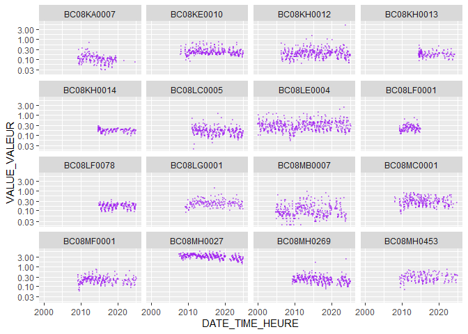

<!-- badges: start -->

[](https://github.com/bcgov/repomountie/blob/master/doc/lifecycle-badges.md)
[](https://travis-ci.org/bcgov/canwqdata)[](https://opensource.org/licenses/Apache-2.0)
[](https://github.com/bcgov/canwqdata/actions?workflow=R-CMD-check)
[](https://codecov.io/gh/bcgov/canwqdata?branch=master)
<!-- badges: end -->

# canwqdata

An R 📦 to download open water quality data from Environment and Climate
Change Canada’s [National Long-term Water Quality Monitoring
Data](http://donnees.ec.gc.ca/data/substances/monitor/national-long-term-water-quality-monitoring-data/).

### Features

This package is designed to get Canadian Water Quality Monitoring data
into R quickly and easily. You can get data from a single monitoring
station, multiple stations, or from an entire basin. Note that current
version of this package can only retrieve data from BC, not from other
provinces.

### Installation

``` r
remotes::install_github("bcgov/canwqdata")
```

### Usage

First load the package:

``` r
library(canwqdata)
library(tidyverse)
#> Warning: package 'purrr' was built under R version 4.4.3
#> Warning: package 'lubridate' was built under R version 4.4.3
```

The first thing you will probably want to do is get a list of the
available BC sites and associated metadata:

``` r
sites <- wq_sites()

sites
#> # A tibble: 50 × 19
#>    SITE_NO    SITE_NAME    SITE_NOM_FR SITE_TYPE SITE_DESC SITE_DESC_FR LATITUDE
#>    <chr>      <chr>        <chr>       <chr>     <chr>     <chr>           <dbl>
#>  1 AK08DC0001 SALMON RIVE… RIVIÈRE SA… RIVER OR… SITE IS … EN AMONT DE…     55.9
#>  2 BC07FB0005 MURRAY RIVE… RIVIÈRE MU… RIVER OR… SITE IS … <NA>             55.6
#>  3 BC07FD0005 PEACE RIVER… RIVIÈRE PE… RIVER OR… AT 203 R… AU PONT DE …     56.1
#>  4 BC08CG0001 ISKUT RIVER… RIVIÈRE IS… RIVER OR… SITE IS … EN AVAL DE …     56.7
#>  5 BC08EE0009 BULKLEY RIV… BULKLEY RI… RIVER OR… SAMPLED … <NA>             54.8
#>  6 BC08EF0001 SKEENA RIVE… RIVIÈRE SK… RIVER OR… AT USK F… AU NIVEAU D…     54.6
#>  7 BC08FC0001 DEAN RIVER … RIVIÈRE DE… RIVER OR… SAMPLED … <NA>             52.5
#>  8 BC08GA0010 CHEAKAMUS R… RIVIÈRE CH… RIVER OR… SAMPLED … PRÉLÈVEMENT…     50.1
#>  9 BC08HA0018 COWICHAN RI… RIVIÈRE CO… RIVER OR… SAMPLED … 1 KM EN AVA…     48.8
#> 10 BC08HB0018 TSOLUM RIVE… RIVIÈRE TS… RIVER OR… RIVER AC… L'ACCÈS À L…     49.8
#> # ℹ 40 more rows
#> # ℹ 12 more variables: LONGITUDE <dbl>, DATUM <chr>, PROV_TERR <chr>,
#> #   PROV_TERR_FR <chr>, PEARSEDA <chr>, PEARSEDA_FR <chr>, OCEANDA <chr>,
#> #   OCEANDA_FR <chr>, DATA_URL <chr>, DATA_URL_FR <chr>, OPEN_DATA_URL <chr>,
#> #   csv_path <chr>
```

Then get some data from a particular station:

`BC08EF0001` is a site in BC called *Skeena River at Usk*

``` r
skeena_river <- wq_site_data("BC08EF0001")

skeena_river
#> # A tibble: 24,901 × 12
#>    SITE_NO    DATE_TIME_HEURE     FLAG_MARQUEUR VALUE_VALEUR SDL_LDE MDL_LDM
#>    <chr>      <dttm>              <chr>                <dbl>   <dbl>   <dbl>
#>  1 BC08EF0001 2000-01-10 10:00:00 <NA>               51.6     0.5         NA
#>  2 BC08EF0001 2000-01-10 10:00:00 <NA>                0.059   0.002       NA
#>  3 BC08EF0001 2000-01-10 10:00:00 <NA>                0.0238  0.0002      NA
#>  4 BC08EF0001 2000-01-10 10:00:00 <                   0.05    0.05        NA
#>  5 BC08EF0001 2000-01-10 10:00:00 <                   0.05    0.05        NA
#>  6 BC08EF0001 2000-01-10 10:00:00 <                   0.0001  0.0001      NA
#>  7 BC08EF0001 2000-01-10 10:00:00 <NA>               18.2     0.1         NA
#>  8 BC08EF0001 2000-01-10 10:00:00 <NA>               11.6     0.5         NA
#>  9 BC08EF0001 2000-01-10 10:00:00 <NA>                1.9     0.5         NA
#> 10 BC08EF0001 2000-01-10 10:00:00 <NA>                0.7     0.1         NA
#> # ℹ 24,891 more rows
#> # ℹ 6 more variables: VMV_CODE <chr>, UNIT_UNITE <chr>, VARIABLE <chr>,
#> #   VARIABLE_FR <chr>, STATUS_STATUT <chr>, SAMPLE_ID_ECHANTILLON <chr>
```

We can also get data from more than one station:

``` r
wq_site_data(c("BC08NF0001", "BC08NM0160"))
#> # A tibble: 28,532 × 12
#>    SITE_NO    DATE_TIME_HEURE     FLAG_MARQUEUR VALUE_VALEUR SDL_LDE MDL_LDM
#>    <chr>      <dttm>              <chr>                <dbl>   <dbl>   <dbl>
#>  1 BC08NF0001 2000-01-04 09:45:00 <NA>              168       0.5         NA
#>  2 BC08NF0001 2000-01-04 09:45:00 <NA>                0.009   0.002       NA
#>  3 BC08NF0001 2000-01-04 09:45:00 <NA>              104       0.01        NA
#>  4 BC08NF0001 2000-01-04 09:45:00 <NA>                0.105   0.0002      NA
#>  5 BC08NF0001 2000-01-04 09:45:00 <                   0.002   0.002       NA
#>  6 BC08NF0001 2000-01-04 09:45:00 <                   0.05    0.05        NA
#>  7 BC08NF0001 2000-01-04 09:45:00 <NA>                2.66    0.07        NA
#>  8 BC08NF0001 2000-01-04 09:45:00 <                   0.05    0.05        NA
#>  9 BC08NF0001 2000-01-04 09:45:00 <                   0.005   0.005       NA
#> 10 BC08NF0001 2000-01-04 09:45:00 <                   0.0001  0.0001      NA
#> # ℹ 28,522 more rows
#> # ℹ 6 more variables: VMV_CODE <chr>, UNIT_UNITE <chr>, VARIABLE <chr>,
#> #   VARIABLE_FR <chr>, STATUS_STATUT <chr>, SAMPLE_ID_ECHANTILLON <chr>
```

Or an entire basin:

The basins are in the `PEARSEDA` column of the data.frame returned by
`wq_sites()`:

``` r
basins <- sort(unique(sites$PEARSEDA))
basins
#> [1] "COLUMBIA"              "FRASER-LOWER MAINLAND" "LOWER MACKENZIE"      
#> [4] "OKANAGAN-SIMILKAMEEN"  "PACIFIC COASTAL"       "PEACE-ATHABASCA"

fraser <- wq_basin_data("FRASER-LOWER MAINLAND")
```

Do some quick summary stats of the fraser dataset:

``` r
library(dplyr)

fraser %>% 
  group_by(SITE_NO) %>% 
  summarise(first_date = min(DATE_TIME_HEURE), 
            latest_date = max(DATE_TIME_HEURE), 
            n_params = length(unique(VARIABLE)), 
            total_samples = n())
#> # A tibble: 16 × 5
#>    SITE_NO    first_date          latest_date         n_params total_samples
#>    <chr>      <dttm>              <dttm>                 <int>         <int>
#>  1 BC08KA0007 2000-01-12 07:45:00 2024-10-09 16:02:00      134         25777
#>  2 BC08KE0010 2000-01-05 12:00:00 2025-01-29 10:25:00      133         32339
#>  3 BC08KH0012 2006-05-11 13:07:00 2025-01-19 10:30:00      178         30411
#>  4 BC08KH0013 2014-06-16 12:45:00 2024-03-12 11:30:00      151         15433
#>  5 BC08KH0014 2014-09-23 14:00:00 2025-01-14 08:00:00      157         15894
#>  6 BC08LC0005 2011-02-24 09:45:00 2025-01-23 11:00:00       98         20392
#>  7 BC08LE0004 2000-01-04 10:00:00 2025-02-21 11:34:00      113         32773
#>  8 BC08LF0001 2000-01-05 12:00:00 2014-12-15 10:20:00       99         19290
#>  9 BC08LF0078 2015-01-07 11:00:00 2025-01-22 12:25:00      132         14115
#> 10 BC08LG0001 2003-06-24 10:45:00 2025-01-14 11:50:00      140         14960
#> 11 BC08MB0007 2004-11-15 12:00:00 2023-12-19 06:00:00      171         27311
#> 12 BC08MC0001 2000-04-18 16:30:00 2024-10-07 16:20:00      155         28860
#> 13 BC08MF0001 2000-01-04 14:10:00 2025-01-23 11:42:00      162         26569
#> 14 BC08MH0027 2000-01-07 12:16:00 2025-01-23 10:09:00      173         47265
#> 15 BC08MH0269 2004-03-03 14:40:00 2025-01-23 14:05:00      168         35013
#> 16 BC08MH0453 2008-09-02 16:25:00 2025-01-09 10:45:00      159         18570
```

We can also look at metadata that helps us understand what is in the
different columns.

`wq_params()` returns a list of water quality parameters (variables),
and related data - units, methods, codes, etc:

``` r
params <- wq_params()
glimpse(params)
#> Rows: 2,621
#> Columns: 12
#> $ VMV_CODE         <dbl> 100081, 100082, 100083, 100084, 100085, 100086, 10008…
#> $ VARIABLE_CODE    <dbl> 371, 387, 392, 410, 454, 461, 468, 517, 517, 575, 589…
#> $ VARIABLE         <chr> "ALUMINUM EXTRACTABLE", "BARIUM EXTRACTABLE", "BERYLL…
#> $ VARIABLE_FR      <chr> "ALUMINIUM EXTRACTIBLE", "BARYUM EXTRACTIBLE", "BÉRYL…
#> $ VARIABLE_TYPE    <chr> "METAL", "METAL", "METAL", "METAL", "METAL", "METAL",…
#> $ VARIABLE_TYPE_FR <chr> "MÉTAUX", "MÉTAUX", "MÉTAUX", "MÉTAUX", "MÉTAUX", "MÉ…
#> $ UNIT_UNITÉ       <chr> "MG/L", "MG/L", "MG/L", "MG/L", "MG/L", "MG/L", "MG/L…
#> $ UNIT_NAME        <chr> "MILLIGRAM PER LITER", "MILLIGRAM PER LITER", "MILLIG…
#> $ UNITÉ_NOM        <chr> "MILLIGRAMME PAR LITRE", "MILLIGRAMME PAR LITRE", "MI…
#> $ METHOD_CODE      <chr> "2628", "2628", "2628", "2628", "2628", "2628", "2628…
#> $ METHOD_TITLE     <chr> "EXTRACTABLE METALS BY INDUCTIVELY COUPLED ARGON PLAS…
#> $ MÉTHODE_TITRE    <chr> "MÉTAUX EXTRACTIBLES PAR ICAP", "MÉTAUX EXTRACTIBLES …

# wq_param_desc shows the column headings (in all other tables) and what they mean
wq_data_desc() %>% 
  glimpse()
#> Rows: 41
#> Columns: 5
#> $ COL_TITLE_TITRE    <chr> "COL_DESCRIPTION", "COL_DESCRIPTION_FR", "COL_TITLE…
#> $ COL_TITLE_FULL     <chr> "COLUMN HEADER DESCRIPTION", "COLUMN HEADER DESCRIP…
#> $ COL_TITRE_COMPLET  <chr> "DESCRIPTION DE L'EN-T\xcaTE DE COLONNE", "DESCRIPT…
#> $ COL_DESCRIPTION    <chr> "COLUMN HEADER DESCRIPTION", "COLUMN HEADER DESCRIP…
#> $ COL_DESCRIPTION_FR <chr> "DESCRIPTION DE L'EN-T\xcaTE DE COLONNE", "DESCRIPT…
```

Let’s look at Total Nitrogen in the Fraser basin:

``` r
fraser_n_total <- fraser %>% filter(VARIABLE == "NITROGEN TOTAL")
```

Now lets do some plotting - plot Total Nitrogen over time at all the
sites, (plot it on a log scale so that they all fit)

``` r
library(ggplot2)

ggplot(fraser_n_total, aes(x = DATE_TIME_HEURE, y = VALUE_VALEUR)) + 
  geom_point(size = 0.4, alpha = 0.4, colour = "purple") + 
  facet_wrap(~ SITE_NO) + 
  scale_y_log10()
```

<!-- -->

It’s also possible to download data from an entire BC:

``` r
bc_sites <- sites %>% 
  pull(SITE_NO)

all_bc_data <- wq_site_data(bc_sites)

glimpse(all_bc_data)
#> Rows: 1,271,399
#> Columns: 12
#> $ SITE_NO               <chr> "AK08DC0001", "AK08DC0001", "AK08DC0001", "AK08D…
#> $ DATE_TIME_HEURE       <dttm> 2000-01-02 14:30:00, 2000-01-02 14:30:00, 2000-…
#> $ FLAG_MARQUEUR         <chr> NA, NA, NA, NA, NA, "<", "<", NA, NA, "<", NA, N…
#> $ VALUE_VALEUR          <dbl> 47.2000, 0.0340, 0.0004, 37.8000, 0.0370, 0.0020…
#> $ SDL_LDE               <dbl> 4e-01, 2e-03, 1e-04, 1e-02, 2e-04, 2e-03, 5e-02,…
#> $ MDL_LDM               <dbl> NA, NA, NA, NA, NA, NA, NA, NA, NA, NA, NA, NA, …
#> $ VMV_CODE              <chr> "1131", "100216", "100250", "100493", "100217", …
#> $ UNIT_UNITE            <chr> "MG/L", "MG/L", "MG/L", "µG/L", "MG/L", "µG/L", …
#> $ VARIABLE              <chr> "ALKALINITY TOTAL CACO3", "ALUMINUM TOTAL", "ARS…
#> $ VARIABLE_FR           <chr> "ALCALINIT TOTALE CACO3", "ALUMINIUM TOTAL", "AR…
#> $ STATUS_STATUT         <chr> "P", "P", "P", "P", "P", "P", "P", "P", "P", "P"…
#> $ SAMPLE_ID_ECHANTILLON <chr> "00PY000078", "00PY000078", "00PY000078", "00PY0…
```

### Project Status

Under development, but ready for use and testing.

### Getting Help or Reporting an Issue

To report bugs/issues/feature requests, please file an
[issue](https://github.com/bcgov/canwqdata/issues/).

### How to Contribute

If you would like to contribute to the package, please see our
[CONTRIBUTING](CONTRIBUTING.md) guidelines.

Please note that this project is released with a [Contributor Code of
Conduct](CODE_OF_CONDUCT.md). By participating in this project you agree
to abide by its terms.

### License

    Copyright 2025 Province of British Columbia

    Licensed under the Apache License, Version 2.0 (the "License");
    you may not use this file except in compliance with the License.
    You may obtain a copy of the License at 

       http://www.apache.org/licenses/LICENSE-2.0

    Unless required by applicable law or agreed to in writing, software
    distributed under the License is distributed on an "AS IS" BASIS,
    WITHOUT WARRANTIES OR CONDITIONS OF ANY KIND, either express or implied.
    See the License for the specific language governing permissions and
    limitations under the License.

This repository is maintained by [Environmental Reporting
BC](http://www2.gov.bc.ca/gov/content?id=FF80E0B985F245CEA62808414D78C41B).
Click [here](https://github.com/bcgov/EnvReportBC-RepoList) for a
complete list of our repositories on GitHub.
